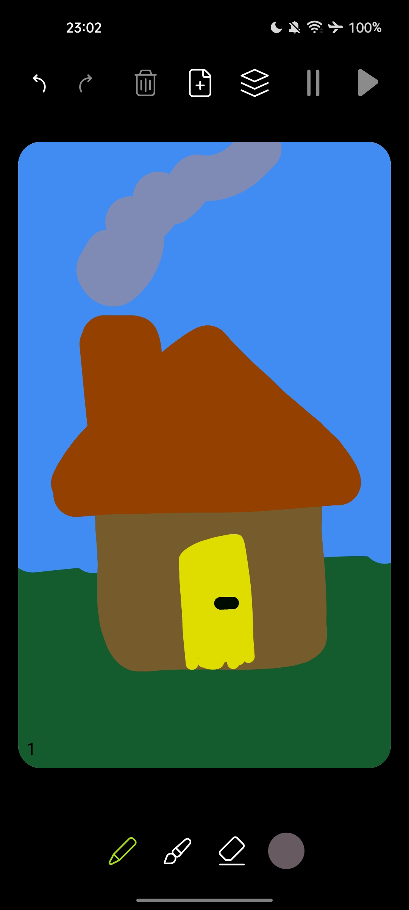
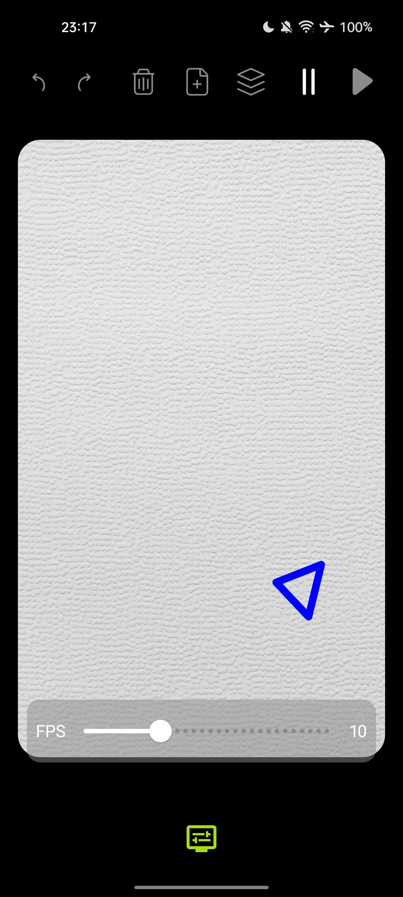
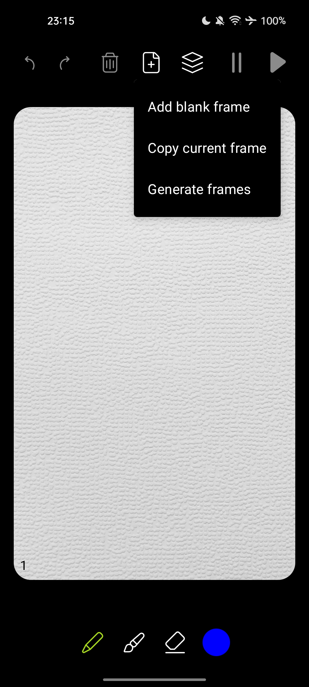
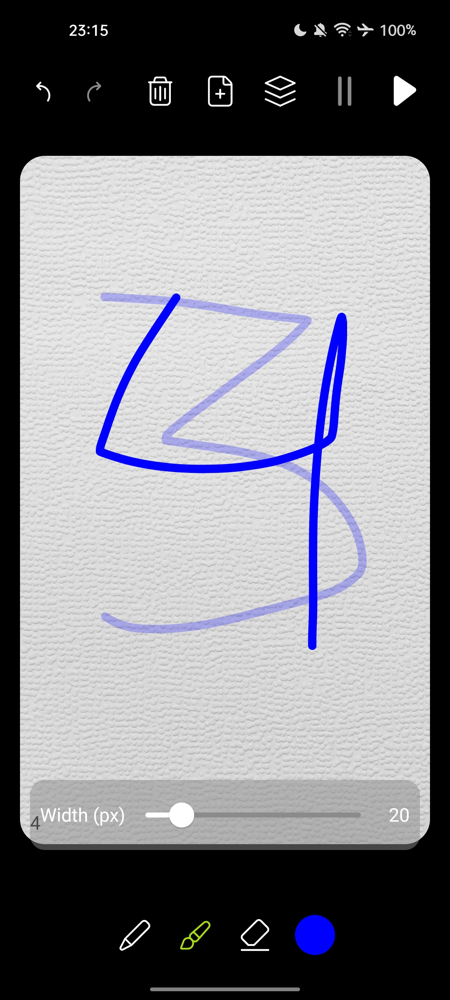
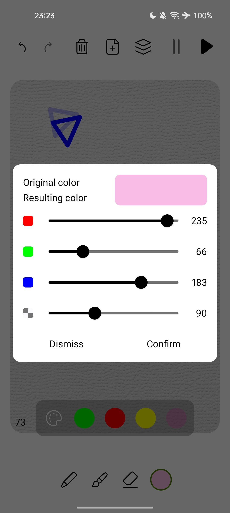
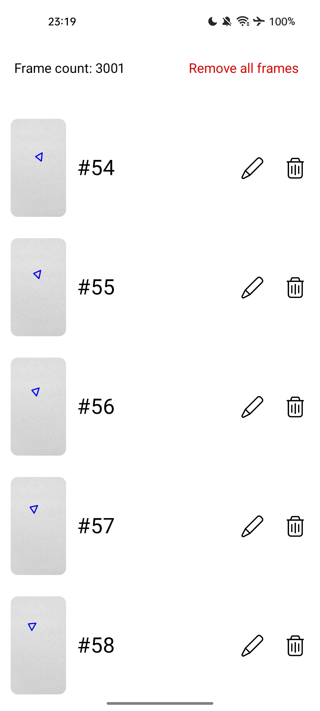
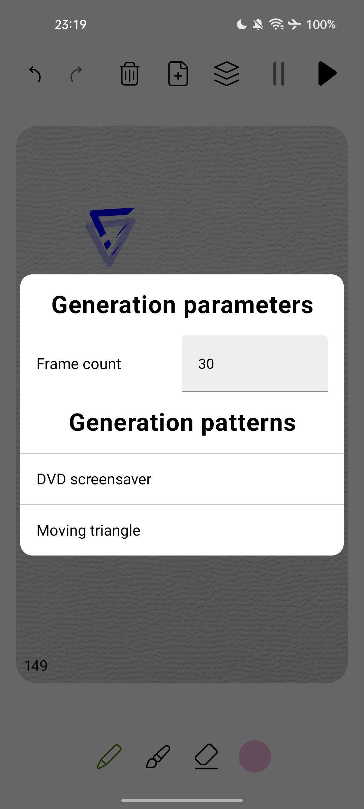

# Sketchimator
Задание полуфинала Yandex Cup 2024.

## Чеклист
Зачеркнутые пункты реализованы в приложении.

### Требования
- ~~Весь UI разрабатывается самостоятельно без использования сторонних библиотек. Допускается использование стандартных библиотек (`AppCompat`, `MaterialDesign`, `JetpackCompose`, ...)~~
- ~~Приложение должно поддерживать API 24+.~~
- ~~Холст — рабочую область для рисования с «бумажным» фоном (картинку необходимо взять из макетов), распознающую действия рисования пользователя. На холстах второго и последующих кадров должен отображаться полупрозрачный эскиз соответствующего предыдущего кадра. При этом такой эскиз не должен являться частью рисунка нового кадра.~~
    - ~~Инструменты рисования: карандаш, который оставляет на холсте следы выбранного цвета, следуя за пальцем, и ластик, который стирает эти следы с холста, также следуя за движением пальца.~~
- ~~Контроль изменения цвета рисования с возможностью выбора как минимум из 3 разных цветов.~~
- ~~Кнопки отмены и возврата последнего действия. Для карандаша и ластика под действием подразумевается непрерывная линия, нанесённая на холст без отпускания пальца.~~
- ~~Кнопку создания следующего кадра. При её нажатии текущий кадр сохраняется для последующего воспроизведения, а на экране появляется чистый холст.~~
- ~~Кнопку удаления текущего кадра, которая возвращает пользователя к рисованию предыдущего кадра.~~
- ~~Запуск и остановку воспроизведения анимации. При старте воспроизведения необходимо выключить или скрыть все элементы управления, кроме холста, на котором воспроизводятся кадры, а также кнопки остановки воспроизведения. Разумеется, любое изменение изображения во время воспроизведения запрещено. Анимация должна воспроизводиться зацикленно, а при остановке анимации необходимо вернуться к последнему кадру.~~
  ~~Количество допустимых кадров не должно ограничиваться в рамках допустимых значений Integer.~~
- ~~Приложение должно корректно отображаться как в светлой, так и тёмной теме.~~

### Дополнительная функциональность
Обратите внимание: дополнительная функциональность указана в порядке убывания приоритета. За выполнение первого пункта из дополнительных требований можно получить значительно больше баллов.
- ~~Генерация и добавление N случайных кадров. Содержание холстов отдаётся на усмотрение участников — к примеру, это может быть генерация различных геометрических фигур или перемещение одной готовой фигуры. Изображения на сгенерированных кадрах должны явно отличаться друг от друга. Количество кадров должно задаваться вводом числа N с размерностью Integer в интерфейсе приложения непосредственно перед генерацией. Сгенерированные кадры добавляются за последним кадром и ведут себя идентично кадрам, добавленным вручную: допускается удаление кадров, изменение последнего кадра и т. д.~~
- ~~Панель либо экран с раскадровкой для переключения между добавленными кадрами. Также допускается реализовать переключение кадров свайпами влево и вправо от края экрана.~~
- ~~Кнопка дублирования кадра — создаёт новый кадр и копирует на него всё содержимое текущего кадра.~~
- ~~Возможность удаления всех кадров сразу.~~
- ~~Настройка скорости воспроизведения анимации.~~
- Экспорт анимации в GIF с возможностью поделиться файлом. Можно использовать стороннюю библиотеку
- ~~Выбор кастомного любого цвета рисования из RGB-палитры.~~
- Инструмент вставки готовых геометрических фигур (минимум 3 готовые разные фигуры) или возможность рисования разных фигур на холсте. Под фигурами подразумеваются: прямые линии, квадрат, прямоугольник, круг, треугольник и т.д. А также взаимодействие с фигурами: увеличение растягиванием или pinch to zoom, перемещение, поворот.
- ~~Изменение толщины карандаша и ластика.~~
- ~~Реализация стека действий для многократной отмены или возврата.~~
- Увеличение холста при помощи жеста pinch-to-zoom для точной прорисовки деталей изображения.
- ~~Иконка приложения.~~
- ~~Полноценная поддержка светлой и тёмной тем.~~

## Скриншоты

| Рисование, доступны ластик и кисть | Настройка скорости воспроизведения     | Разные варианты создания кадра            |
|------------------------------------|----------------------------------------|-------------------------------------------|
|        |  |  |

| Отображение предыдущего кадра, выбор толщины инструмента | Выбор произвольного цвета из RGB-палитры, поддержка светлой и тёмной тем |
|----------------------------------------------------------|--------------------------------------------------------------------------|
|            |                                        |          

| Раскадровка с возможностью редактировать произвольный кадр | Настройка генерации кадров                         |
|------------------------------------------------------------|----------------------------------------------------|
|                             |  |
